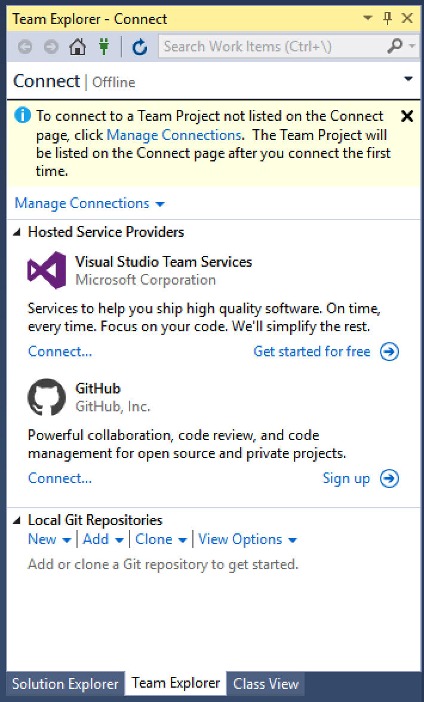

# GitHub and Visual Studio, Part 1
https://git-scm.com/doc

## Version Control
A **version control system** is a tool that tracks changes to a set of files
over time.  As we create code, it becomes convenient to keep a record of the 
history of our files.  Just as using the undo feature of a text editor or IDE
enables us to quickly revert recent changes, version control let's us return 
to a previous state at any time.  Version control also allows us to see when 
code was changed - this can be helpful when debugging: if users report that 
a program stopped functioning properly around a certain time, developers can 
examine the history of the source code around that time using version control.

A simple but common approach to version control is to simply make copies of 
files.  A developer might keep various folders representing different versions 
of the project over time.  While this is a pretty straightforward approach, 
the level of manual effort makes it prone to error - it's pretty easy to delete 
or overwrite the history or accidentally save a version to a location different 
from other versions.  

Various software packages exist to help mitigate some of the risks of manually 
keeping a history and automate the process.  Concurrent Version System (CVS), 
Subversion, Mercurial, and Git are examples of software version control systems. 

## Git
Git is one of many version control systems and is one of the most popular ones. 
In a basic version control system, we can say that there are two states to a 
set of changes made to files: being in the working directory or being in the 
repository.  As we edit files, add new code or change existing code, we are 
working in the **working directory**.  At some point, we'll have implemented a 
set of changes to our code, whether we're fixing a bug or have made significant 
progress toward implementing a new feature, that we'd like to preserve the code 
in it's current state so we can examine it again later if necessary.  When we 
do this, we can check the code into the **repository**, an archive of versions 
of files.  We can easily review the history of our files in the repository and 
move between versions.

In addition to the working directory and the repository, git has an additional 
level of tracking: the staging area.  After we create and alter files in the 
working directory, we can choose which modified files we'd like to add to the 
repository by first adding them to the staging area.  Once in the staging area, 
we can commit the set of changes to the repository.  

The following diagram, from git-scm.com, illustrates a common workflow 
involving the working directory, staging area, and repository (the repository 
is usually stored in a subdirectory of the project folder named `.git`).

## GitHub
Most version control systems allow the repository to be hosted in a remote 
location - a computer other than the one being used to modify the files.  Git 
allows us to setup a remote repository to track and store our changes.  When 
we use a remote repository, we can *pull* and *push* changes between the 
repository on our computer and the remote repository.  A remote repository 
not only serves as a backup of our local repository, it also allows us to 
easily collaborate with other.  A remote repository provides a common location 
where we can add our changes and get other people's changes.  GitHub is a 
popular service for hosting remote repositories.  In order to use GitHub, 
we'll need to create an account.  Once we have an account, we can create 
a repository and begin tracking our changes.  The remainder of this text 
assumes that you have a GitHub account. 

## GitHub and Visual Studio
For the following examples, we'll be using Visual Studio 2015 Community.  
While Visual Studio includes built-in integration with git and we can use 
that to work with GitHub, there is an extension that makes working with GitHub 
a lot easier; the extension is named "GitHub Extension for Visual Studio" and 
is maintained by GitHub.  If you don't have the extension installed, installed 
it before proceeding.  We'll also need the git executables for windows which 
can be downloaded from 

https://git-scm.com/download/win

We'll start by creating a new repository with a new solution. To begin working 
with GitHub, select **Team** from the menus followed by **Manage Connections**.  

From the newly opened team explorer view, click **Connect** in the GitHub 
section and enter your GitHub username and password.  Next, click **Create**. 
Enter a repository name and description and lick **Create**.  

Once the repository has been created, click `Create a new project or solution`. 
At this point, Visual Studio will create several files including a `Program.cs` 
file.  Add some code to the file.  To commit these new files and the code we've 
added, click the home icon in the team explorer followed by **Changes**. If 
prompted, enter your name and email address - these will be used to associate 
changes with you.  In the team explorer window, type a commit message 
describing your changes, click the drop-down arrow next to commit, and select 
**Commit All and Push**.  Your new project should be visible on GitHub.  As we 
make changes, we can commit and push them, using the changes view in team 
explorer.    
