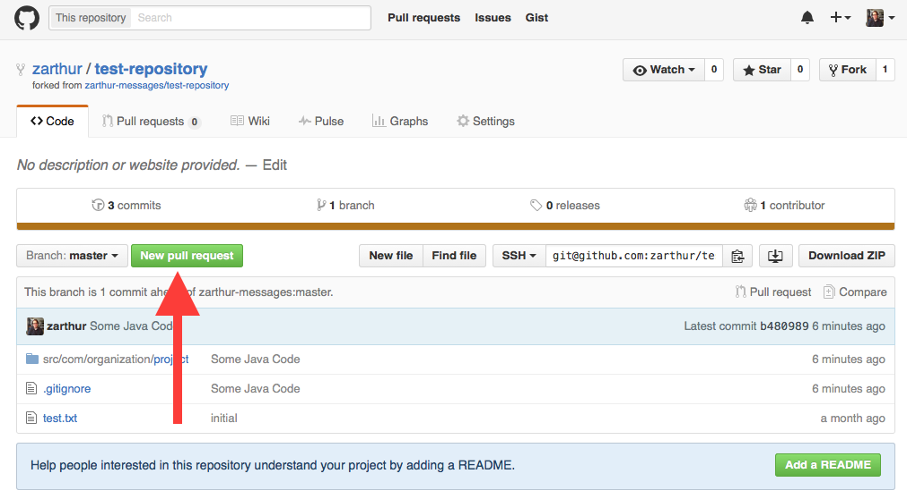
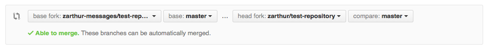
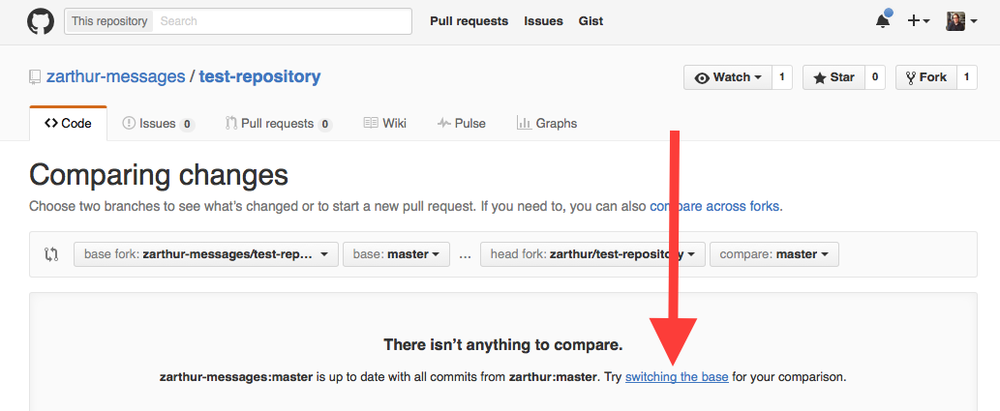

# GitHub and Visual Studio, Part 2

These notes will make use of GitHub Desktop available from
https://desktop.github.com/

## Forks and Pull Requests
A **fork** of a repository is simply a copy. When you fork someone else's
repository you are simply creating a copy of that repository in your own
collection of repositories.  When forking a repository, GitHub keeps track
of the **upstream**, or original, repository.  To fork a repository, simply
browse to the repository's page on GitHub and click the *fork* button near
the upper right of the page.

After we've made changes to our fork, we can request that the owner of the
original repository incorporate the changes with their copy.  To do this, we
create a **pull request** on GitHub.  To create the pull request, browse to the
GitHub page for your fork and click the *New pull request* button.



GitHub will load a page summarizing the changes made to your fork that will
constitute the pull request.  Notice the comparison settings.



On the left, we have the repository to which changes will be made if the pull
request is accepted.  On the right we have the source of the changes that make
up the pull request.

Once we click *Create pull request*, we have the option to summarize our
changes and create a comment.  Clicking *Create pull request* again will create
the pull request and give the repository owner a chance to accept or reject
our request.  If the owner merges our pull request, our changes will be
incorporated in the original repository.

We can also use pull requests when changes are made to the original repository
and we'd like to update our fork to include those changes.

On the GitHub page for our fork, we can click "New pull request".  Notice that
if our fork doesn't have any new changes, the page indicates that there isn't
anything to compare.  We have to change what is being compared.  Click the
*switching the base* link to change the comparison.



Now, the *base fork*, the destination of the changes, is our own repo and the
*head fork*, the source of the changes, is the original repo.  Create the
pull request.  Because this is an update to a repo we own, we are able to merge
the pull request by clicking *Merge pull request*.

## Example Workflow
As an example, we'll look at using forking and pull requests to add code to
a repository.  To be clear, we'll refer to the original repository as "original
repository" and the fork we create for our changes as "fork repository".

For the start of this example, suppose we are working as part of a team that
is creating a simple calculator application named *CSharpCalculator*.  You've
been asked to work on the user interface and someone else is working on the
code responsible for doing calculations.  At this point the code consists
primarily of two files: `Program.cs` and `ICalculator.cs`.

**Original Repository: Program.cs**
```cs
namespace CSharpCalculator
{
    class Program
    {
        static void Main(string[] args)
        {
        }
    }
}
```

**Original Repository: ICalculator.cs**
```cs
namespace CSharpCalculator
{
    interface ICalculator
    {
        int add(int operand1, int operand2);
        int subtract(int operand1, int operand2);
        int multiply(int operand1, int operand2);
        int divide(int operand1, int operand2);
    }
}
```

So at this point, all we've got is an interface that specifies what type of
methods we can use with the calculator.

To begin adding our changes, we can fork the repository and clone it in Visual
Studio.  To clone the repository, select the **Clone** option in the GitHub
section of **Team Explorer** in Visual Studio. You should be able to browse
through all your repositories and select the newly forked repo.  Click
**Clone** to create a local copy.  Next, select **Open an existing project or
solution** and browse to the cloned solution file.

Let's add a new class representing the user interface that simply demonstrates
some calculator functionality.

**Fork Repository: UserInterface.cs**
using System;
using System.Collections.Generic;
using System.Linq;
using System.Text;
using System.Threading.Tasks;

```cs
using System;

namespace CSharpCalculator
{
    class UserInterface
    {
        private ICalculator calculator;

        public UserInterface(ICalculator calculator)
        {
            this.calculator = calculator;
        }

        public void demo()
        {
            int sum = calculator.add(2, 2);
            int product = calculator.multiply(3, 4);
            Console.WriteLine("The sum of 2 and 2 is " + sum);
            Console.WriteLine("The product of 3 and 4 is " + product);
            Console.ReadLine();
        }
    }
}
```

Now that we've written some code, we'd like to commit and push our code to
the forked repository.  We can do that using the team explorer in Visual Studio.

Once the code is on GitHub, we'd like to merge our code with the original
repository.  To do this, open a pull request.  From the forked repository page
on GitHub, click the **New pull request** button.  The next page will display
a summary of changes; click **Create pull request**.  After adding a
description, click **Create pull request** again.

One the pull request has been created, it is up to the maintainers of the
original repository to accept or reject the request.  Typically, when a request
is rejected, the reasons for rejection are provided as comments.  Let's assume
the UI changes are accepted.

We'll continue our work on the UI in a moment but let's assume someone else
has added additional code since our pull request that implements the
*ICalculator* interface.

**Original Repository: Calculator.cs**
```cs
namespace CSharpCalculator
{
    class Calculator : ICalculator
    {
        public int add(int operand1, int operand2)
        {
            return operand1 + operand2;
        }

        public int divide(int operand1, int operand2)
        {
            return operand1 / operand2;
        }

        public int multiply(int operand1, int operand2)
        {
            return operand1 * operand2;
        }

        public int subtract(int operand1, int operand2)
        {
            return operand1 - operand2;
        }
    }
}
```

At this point, the original repository is now ahead of the fork - there is
newer code that hasn't been added to the fork.  We'd like to pull those changes
into  the fork.  To do that, we'll create a pull request from the fork repo but
this time we'll choose **switching the base**.  Because we're pulling changes
to a repository that we maintain, we can both create and merge the pull request.

To get the updated code into Visual Studio, we will have to pull from the
remote repository.  Click **Pull** from the team explorer.  Once we have the
latest changes, let's modify *Program* to create an instance of *Calculator*
and use it with an instance of *UserInterface*.

**Fork Repository: Program.cs**
```cs
namespace CSharpCalculator
{
    class Program
    {
        static void Main(string[] args)
        {
            ICalculator calculator = new Calculator();
            UserInterface ui = new UserInterface(calculator);
            ui.demo();
        }
    }
}
```

We can commit and push these changes to the fork repository.

Suppose someone has also made a change to `Program.cs` in the original
repository while we've been working on our fork.

**Original Repository: Program.cs**
```cs
namespace CSharpCalculator
{
    class Program
    {
        static void Main(string[] args)
        {
            // create a calculator for use with the UI
            ICalculator calc = new Calculator();

            // run demo
        }
    }
}
```

Now if we try to create a pull request from the fork to incorporate our changes
into the original, we'll be notified that the changes cannot be automatically
merged.  We have two options:

- to pull changes from the original into the fork, deal with the merge, then
open a pull request to incorporate changes form the fork into the original
- open a pull request to incorporate changes from the fork into the original
an let the maintainers of the original repo work out the merge details

Typically, we'll choose the first option.  So let's switch the base so that
the base fork is the fork repo and the head fork is the original repo.  Create
the pull request. Unfortunately, we cannot merge the pull request from the
GitHub website.  Instead we'll have to rely on the command line or the GitHub
desktop app.

When we view the repository in the desktop app, we can view the pull request
by selecting the branch corresponding to the pull request. Once the branch is
selected, we can choose **Update from master** and **View Conflicts**.  Right-
click on the file with conflicts and select "Open file".  In the editor make
any necessary changes and save the file. Now we can commit from GitHub Desktop.

We can now merge our changes back into the master branch of the fork repository
by first selecting the pull request branch in GitHub Desktop and creating a new
pull request.  Next, we'll merge this on the GitHub website. Notice that the
original pull request now indicates that it has been merged.  This has
reconciled the differences between the original repository and the fork
repository.  We still have to create a pull request to get the changes from the
fork into the original.

